# Grounded-SAM2 + Flux Kontext LoRA for On-Model Color Correction

This pipeline is designed for garment color trasfer/correction from a reference image to a on-model one. It's main part consist in:

1) Automatic dataset creation: Grounded-SAM2 automatically detects and segments the target garment for later degradation. 
2) Flux.1-Kontext-Dev LoRA training on side-by-side pairs — [left] reference garment (still-life) | [right] on-model — where the model learns to transfer the left reference color to the right side, while preserving texture and limiting unwanted edits.

## The process

### Dataset creation

I manually selected 60 still-life and 60 on-model high-quality images online. After having them renamed, I tried SAM2 [1] segmentation models to automatically distinguish and mask different garments worn. An example below: 

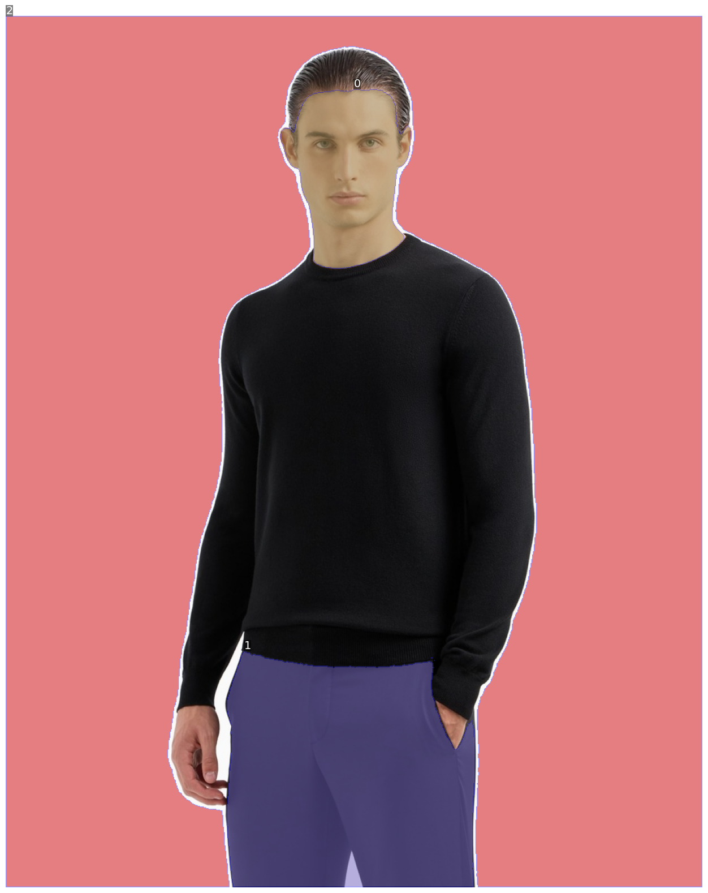

The challenge with this approach lies in ensuring that we select the appropriate mask for the on-model images: I opted for Grounding DINO [2], an open-vocabulary, zero-shot object detection model that utilizes text prompts to locate and draw bounding boxes around objects in an image. This model enabled me to detect the garment before segmenting it. The outcome of this approach is essentially the Grounded-SAM2 approach [3].

However, I’ve encountered a challenge: since it’s an open-vocabulary model, we can simply label any object we want, and it returns multiple bounding boxes, ordered by decreasing accuracy. The issue is, how can we determine beforehand if the garment we want is the one with the highest accuracy? To address this, I decided to:

1) First, run Grounding DINO on the still-life (of course they have the same number of the corresponding on-model images) to know which kind of labels the model assigned to the object, given a fixed set of labels:

```python
# Define the set of garment labels to use with Grounding DINO
labels = [
    "shirt",
    "trousers",
    "dress",
    "jacket",
    "gilet",
    "pants"
]
```

2) After the label detection, I saved the results as a dictionary in *"garments.json"*:

```json
{
    "still-life32.jpg": "jacket",
    "still-life26.jpg": "pants",
    "still-life14.jpg": "dress",
    "still-life07.jpg": "shirt",
    "still-life45.jpg": "gilet",
    "still-life53.jpg": "trousers"
    // ... more entries
}
```

3) Finally, I used the dictionary entries in Grounded-SAM2 to automatically mask the correct garment we want to degrade. Once I obtained the masks, I just applied a random color/hue shift.

This approach resulted in a complete automatic detection, segmentation and masking process.

### Training Flux.1-Kontext-Dev

I decided to fine-tune a Diffusion Model for color-garment translation. Due to limited compute resources, I opted for training a LoRA to maximize efficiency and speed. LoRA is often sufficient to adapt big LLMs or Diffusion Models to new tasks since they already possess a substantial pre-trained knowledge base.

A traditional image-to-image pipeline with inpainting wouldn’t work for this task because it introduces noise in the region we want to regenerate and, in this case, it would disrupt all the garment textures and shades. The only solution would be to train a Control-Net or IP-Adapter to inject image positions and textures at each forward block to preserve the original material.

However, with the recent surge of in-image editing models like Flux.1-Kontext-Dev [4] and Qwen-Image-Edit [5], I wanted to experiment with one of these models.

The strength of these models lies in their ability to concatenate a reference image with the target latent image, allowing the model to refer to it during denoising. This process is enabled by the use of 3DRoPE [6], which aligns the corresponding position between the target and reference images.

From an architectural perspective, these models seem highly suitable for this kind of task; however, the challenge is that they can only provide one reference image at a time.

After doing plenty of research, I discovered that some users attempted to concatenate the images side by side, and in some cases, the model worked to make reference to one of the images while altering the other. Though, with plain Kontext, color translation was nonexistent.

Therefore, I stitched the dataset images in the following manner:

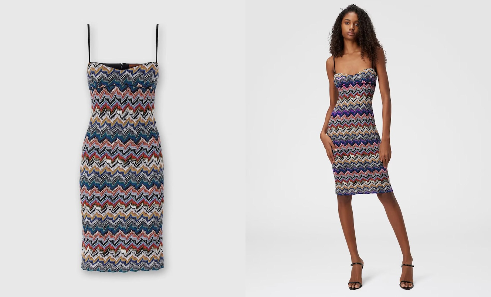

Finally, I reused *"garments.json"* to build the corresponding text prompt like below:

```python
t.write(f"chromiq Change the {v} color on the right to match the left")  # trigger word is "chromiq"
```

#### Training setup

To train Kontext, I used AIToolkit by Ostris [7], which is a well maintained LoRA trainer for several Diffusion Models. Since the aim of the task is to only modify the right side of the images (the garment), I chose to mask the loss function in order to not waste model capability on recreating also the left side: in this way, the gradient signal was focused only on the part of the images that matters for this problem (the right!), speeding up training and maintaining efficiency. 

In addition, weight decay was set to 0 and the learning rate at 0.0001 to check as fast as possible if the approach worked.
Due to limited compute resources, I couldn't train for more than 5200 steps, taking an overall 15 hours on an Nvidia RTX 6000 Pro. For the detailed hyperparameters setup, please check *"config.yaml"*.

An issue I have encountered is that different websites have different aspect-ratios for the on-model images, so it was hard to resize without any streching or cropping. In the end, I resized and padded all the pair images with 1328 x 800, which is one of the supported Kontext resolutions [8].

## Results and evaluation metrics

The results were encouraging, considering the limited dataset and not optimal aspect-ratio for all the test images. The test set is composed by the 5 Shootify images + 3 I obtained online. Of course, the images were not used in training to ensure no data leakage and maintain the evaluation correct.

Below the **qualitative results** on the 8 generated images (note that the images are padded before and it is not the result of a poor generation):

<table>
    <tr>
        <th>Input Pair</th>
        <th>Generated Output</th>
        </tr>
        <tr>
        <td colspan="2" align="left"><i>1.jpg</i></td>
        </tr>
        <tr>
        <td>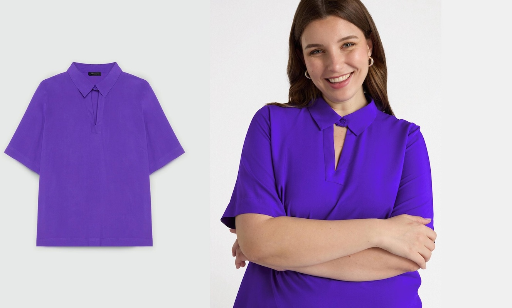</td>
        <td>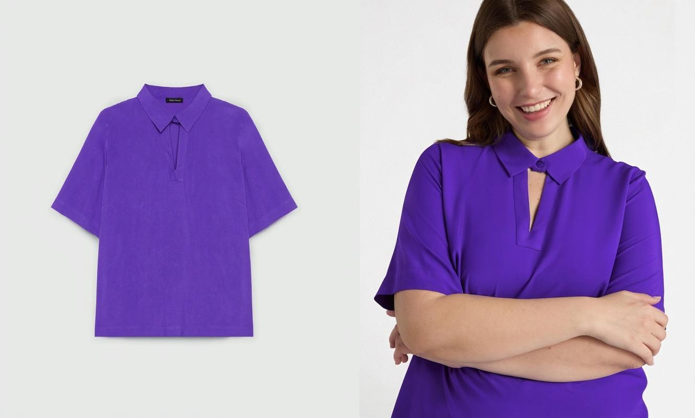</td>
        </tr>
        <tr>
        <td colspan="2" align="left"><i>2.jpg</i></td>
        </tr>
        <tr>
        <td>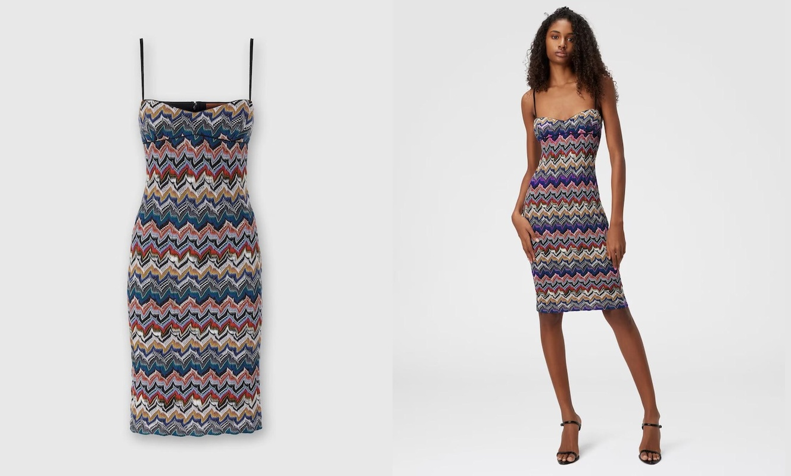</td>
        <td>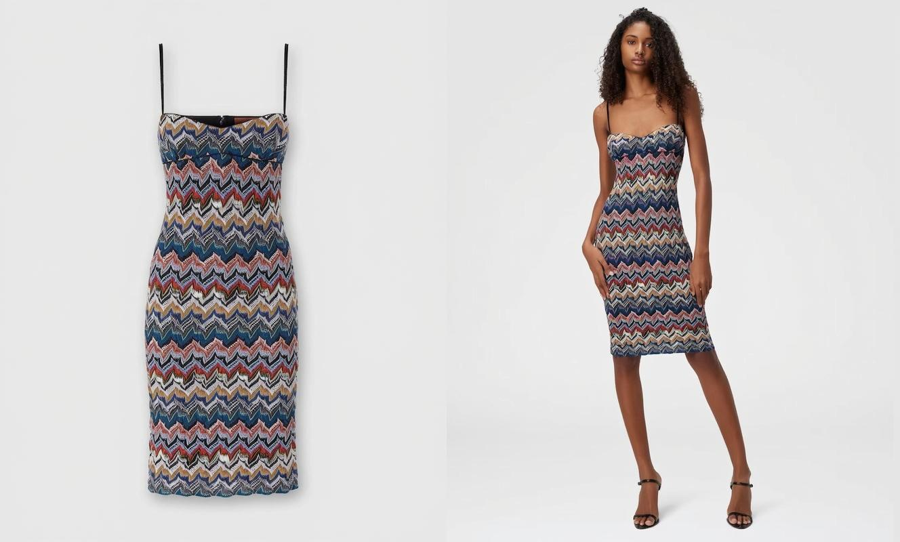</td>
        </tr>
        <tr>
        <td colspan="2" align="left"><i>3.jpg</i></td>
        </tr>
        <tr>
        <td></td>
        <td>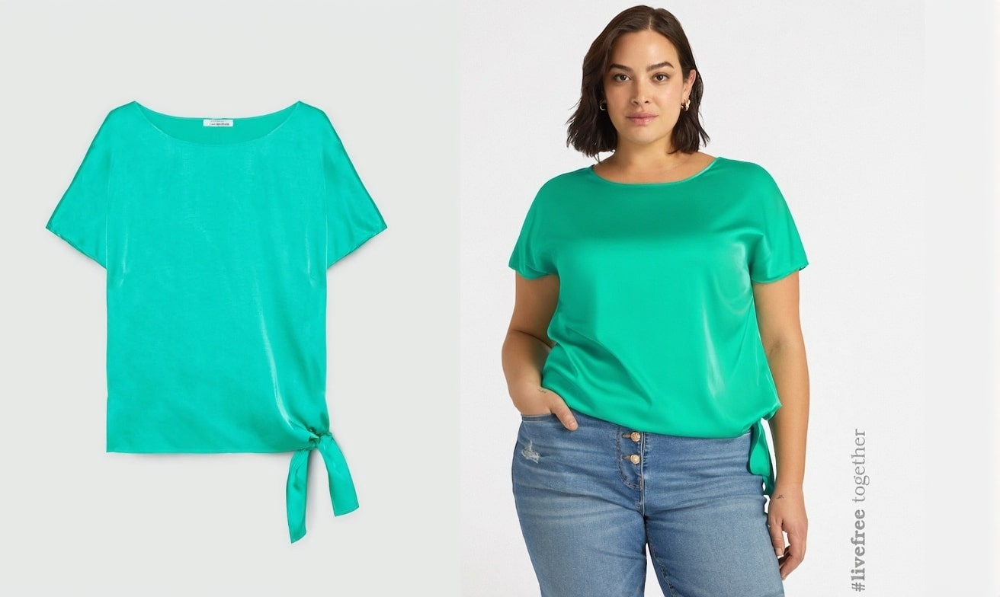</td>
        </tr>
        <tr>
        <td colspan="2" align="left"><i>4.jpg</i></td>
        </tr>
        <tr>
        <td>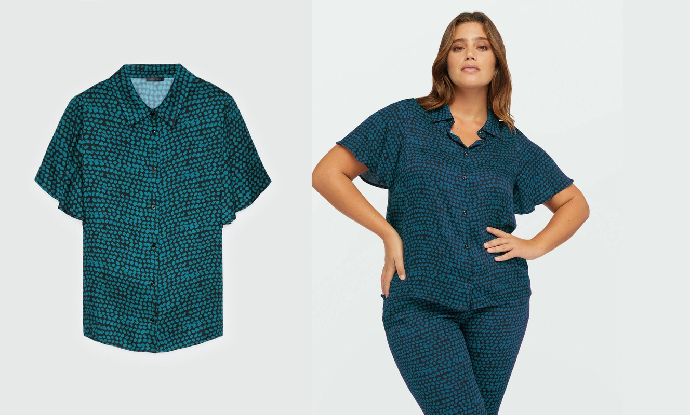</td>
        <td>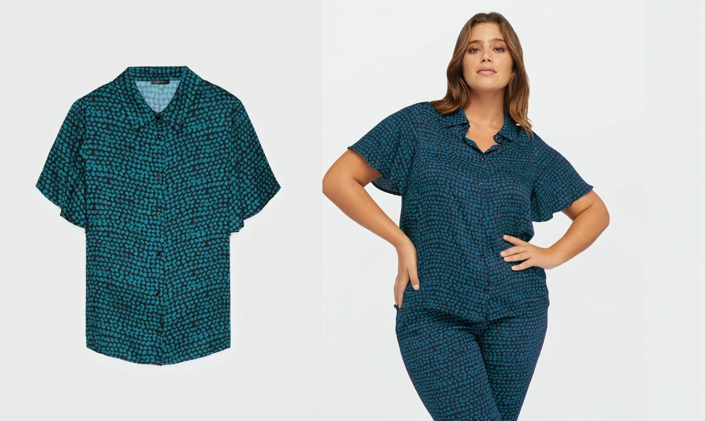</td>
        </tr>
        <tr>
        <td colspan="2" align="left"><i>5.jpg</i></td>
        </tr>
        <tr>
        <td></td>
        <td>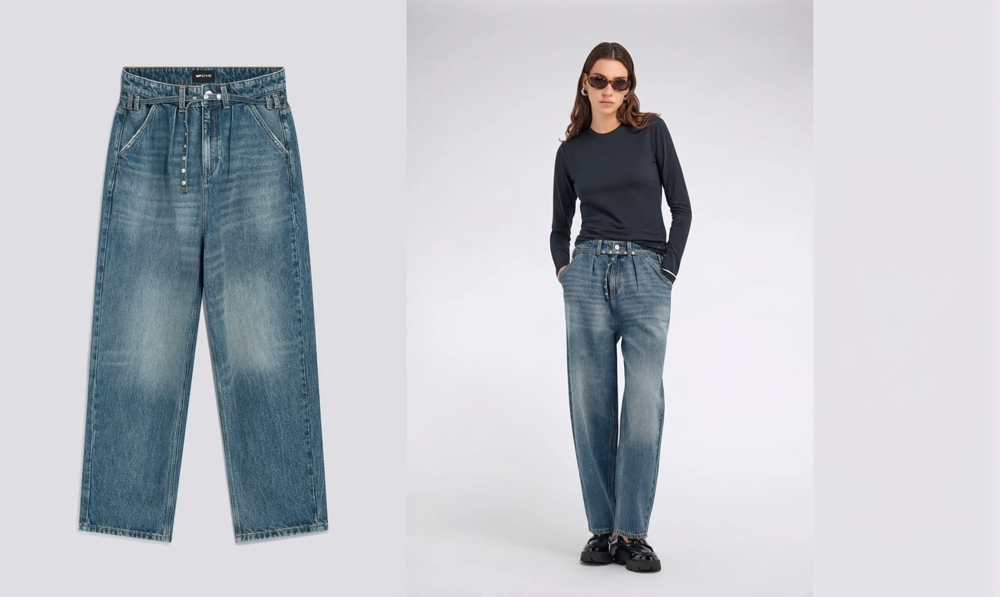</td>
        </tr>
        <tr>
        <td colspan="2" align="left"><i>6.jpg</i></td>
        </tr>
        <tr>
        <td>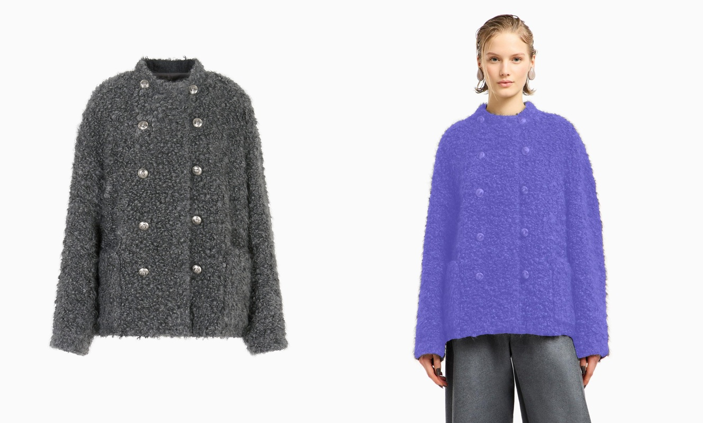</td>
        <td>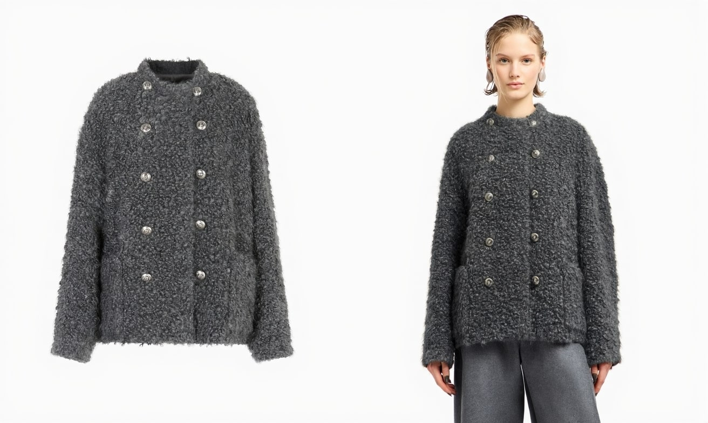</td>
        </tr>
        <tr>
        <td colspan="2" align="left"><i>7.jpg</i></td>
        </tr>
        <tr>
        <td>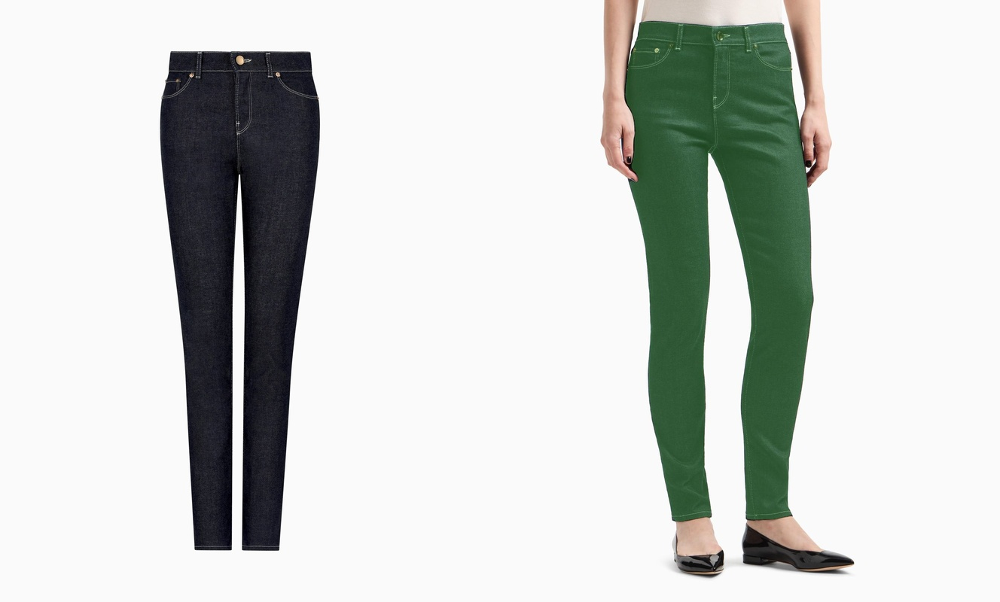</td>
        <td>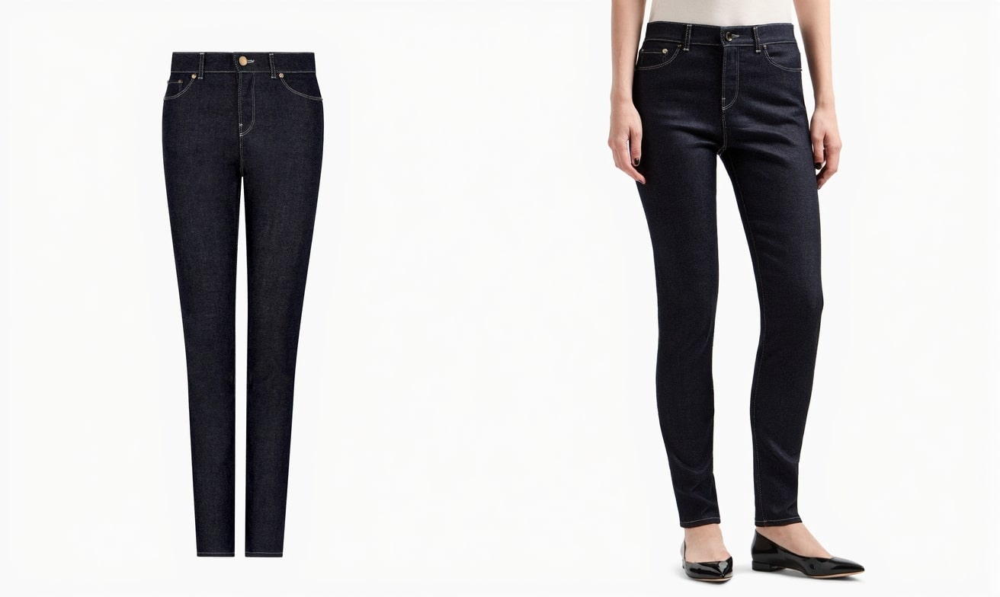</td>
        </tr>
        <tr>
        <td colspan="2" align="left"><i>8.jpg</i></td>
        </tr>
        <tr>
        <td>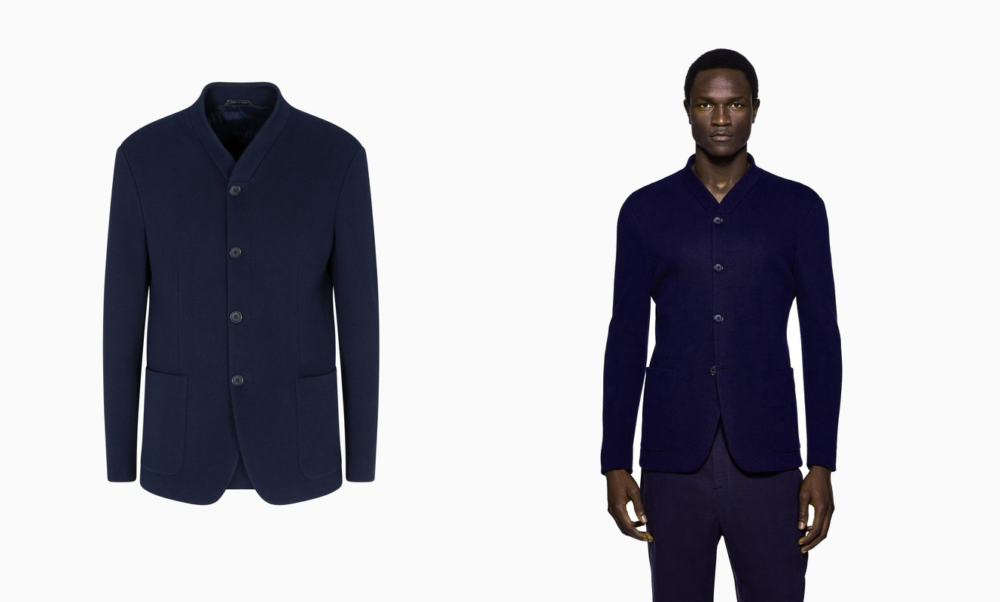</td>
        <td>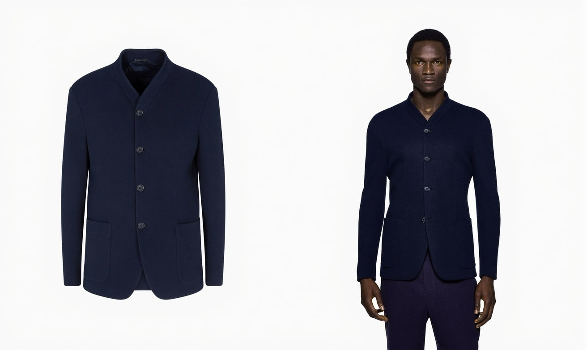</td>
        </tr>
</table>

For a **quantitative analysis**, I decide to use $∆E_{00}$ metric to measure the color consistency between:

- control images and ground truth;
- generated images and grount truth.

Initially, I tried plain MAE in RGB but it isn’t perceptually uniform, equal numeric errors can look very different, so it can underweight hue errors or overweight luminance, giving misleading “color consistency” scores.
Therefore, I switched to ΔE (especially CIEDE2000), which measures color differences in a perceptual space (Lab), aligning more with how humans see hue and chroma shifts, so it penalizes more the kinds of mismatches customers notice.

At first, I tried to run Grounded-SAM2 to compute ∆E only on the region mask but, due to tiny segmentation inconsistency, the results were often inconsistent. Thus, I decided to select a fixed portion of each garment to have a consistent evaluation; for example, "7.jpg" became like this:

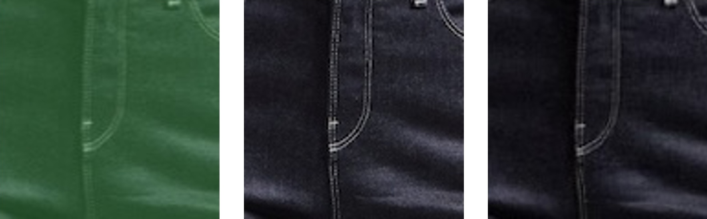

<p align="center"><em>from the left: control &mdash; ground-truth &mdash; generated</em></p>

Results for $∆E_{00}$:

<table align="center">
    <tr>
        <th>Image</th>
        <th>Mean ΔE (gen vs gt)</th>
        <th>Mean ΔE (control vs gt)</th>
    </tr>
    <tr><td>1.jpg</td><td>5.788</td><td>7.178</td></tr>
    <tr><td>2.jpg</td><td>14.858</td><td>20.674</td></tr>
    <tr><td>3.jpg</td><td>6.858</td><td>9.189</td></tr>
    <tr><td>4.jpg</td><td>15.541</td><td>9.217</td></tr>
    <tr><td>5.jpg</td><td>7.707</td><td>10.987</td></tr>
    <tr><td>6.jpg</td><td>12.135</td><td>29.913</td></tr>
    <tr><td>7.jpg</td><td>4.337</td><td>28.366</td></tr>
    <tr><td>8.jpg</td><td>2.496</td><td>6.970</td></tr>
    <tr>
        <td><strong>Average</strong></td>
        <td><strong>8.715</strong></td>
        <td><strong>15.312</strong></td>
    </tr>
</table>

These results are very promising, especially given the limited training and narrow dataset variety: it’s already cutting color error by ~40% on average across most images (only one was not improved). With a bit more data diversity and small pipeline tweaks (better mask/compositing, aspect-ratio alignment), this approach should tighten ΔE further toward a studio target range.


## Next steps

There is much headroom for improvement with more time and compute resources. In particular:

- Try/fine-tune different Grounded-SAM2 models to improve mask segmentation quality and dataset creation;
- Broaden the dataset to include more diversity and be more representative, particularly in different poses and image aspect ratios, which I’ve noticed are Kontext’s weakest areas.
- Extend the training time and fine-tune various in-image editing models, such as Qwen-Image, to assess the best one for this use-case.

## WIP on Qwen

1750 steps

<table>
    <tr>
        <th>Ground Truth</th>
        <th>Degraded</th>
        <th>Generated</th>
    </tr>
    <tr>
        <td colspan="3" align="left"><i>1.jpg</i></td>
    </tr>
    <tr>
        <td></td>
        <td>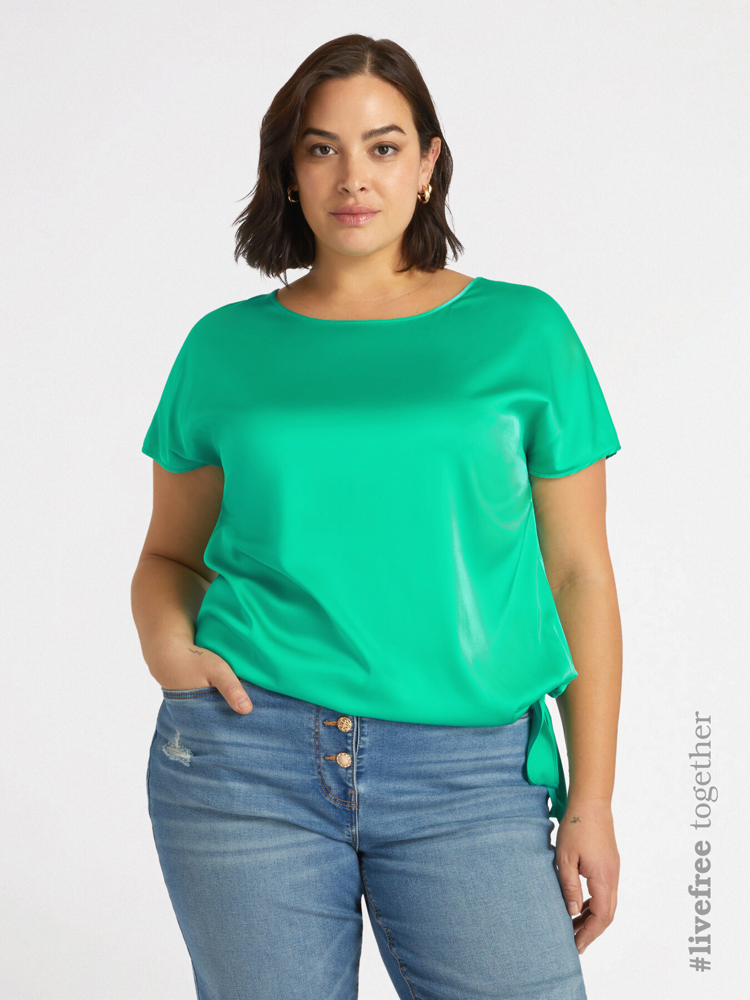</td>
        <td>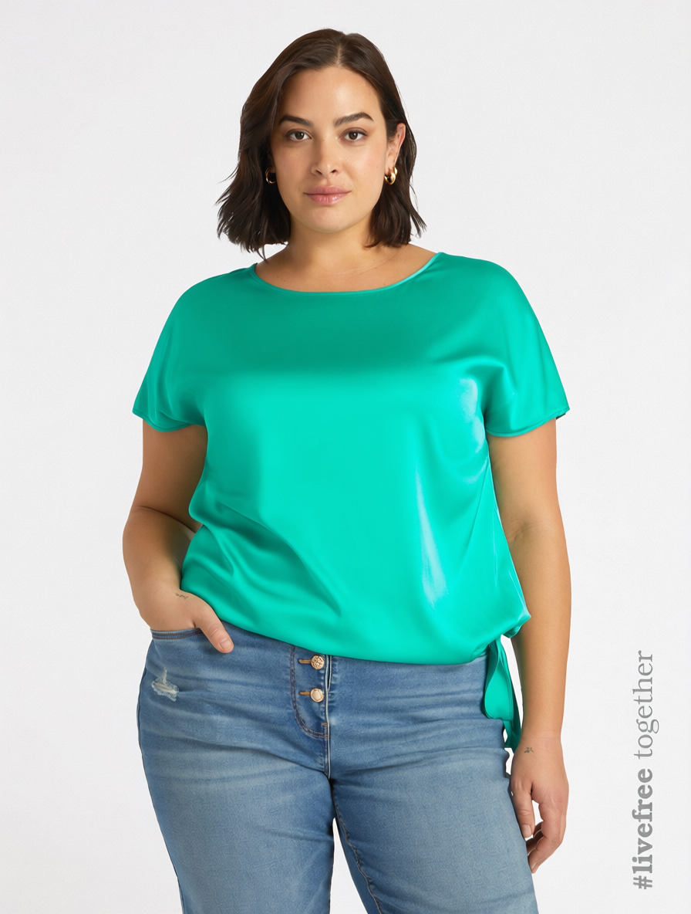</td>
    </tr>
    <tr>
        <td colspan="3" align="left"><i>2.jpg</i></td>
    </tr>
    <tr>
        <td>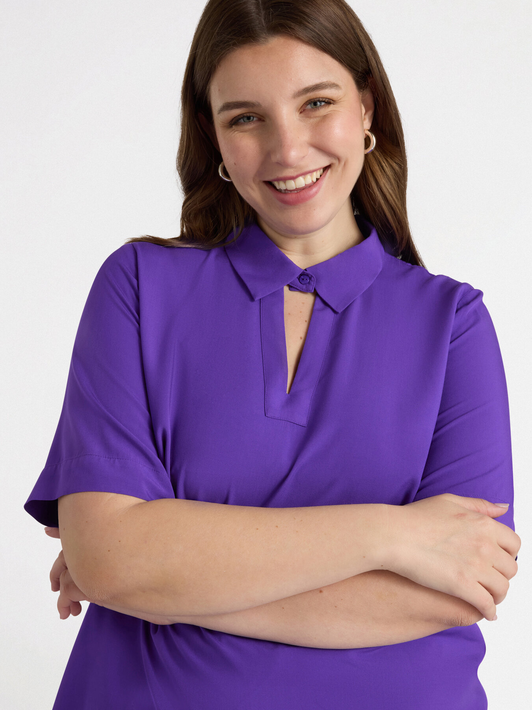</td>
        <td>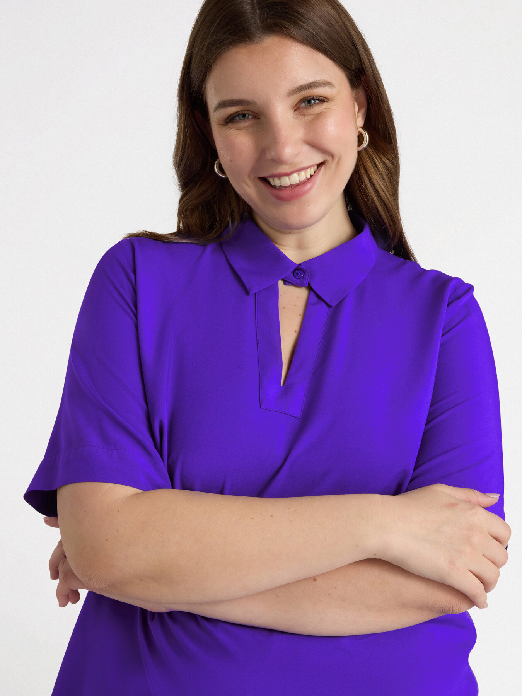</td>
        <td>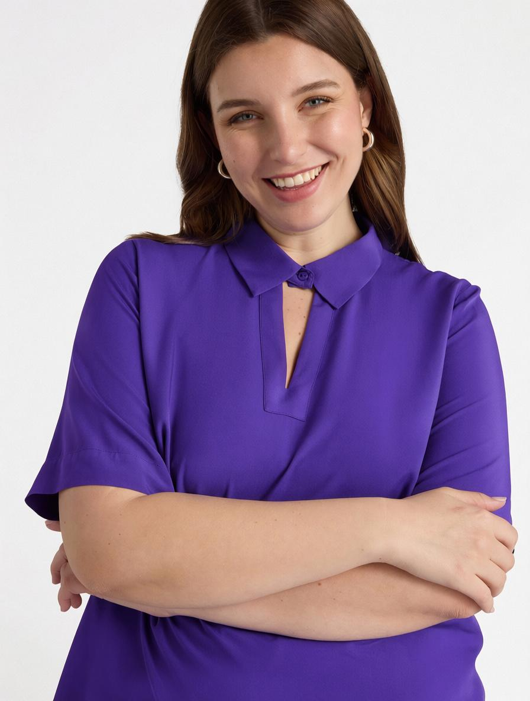</td>
    </tr>
    <tr>
        <td colspan="3" align="left"><i>3.jpg</i></td>
    </tr>
    <tr>
        <td></td>
        <td>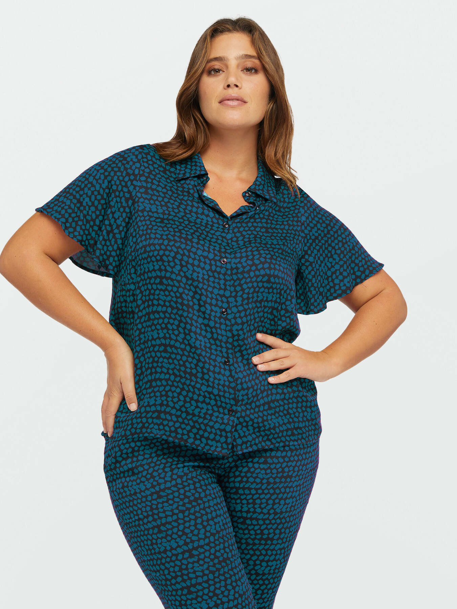</td>
        <td>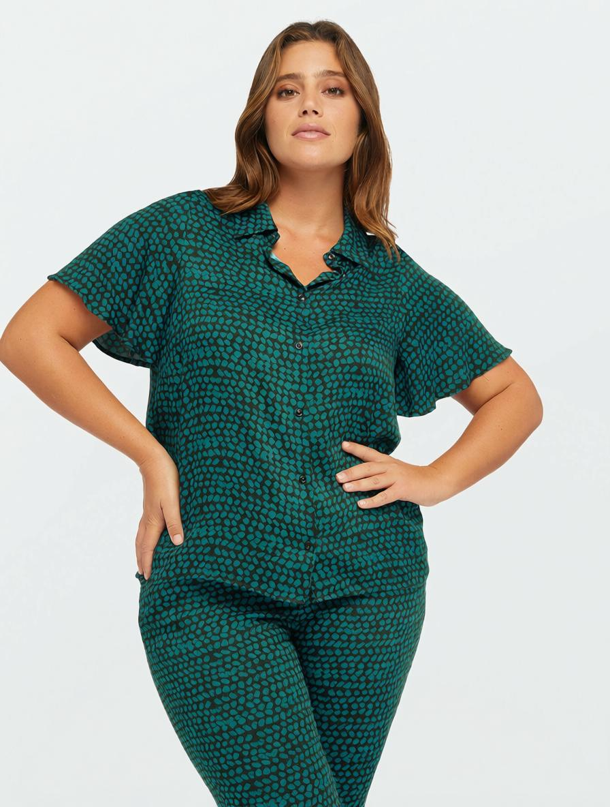</td>
    </tr>
    <tr>
        <td colspan="3" align="left"><i>4.jpg</i></td>
    </tr>
    <tr>
        <td>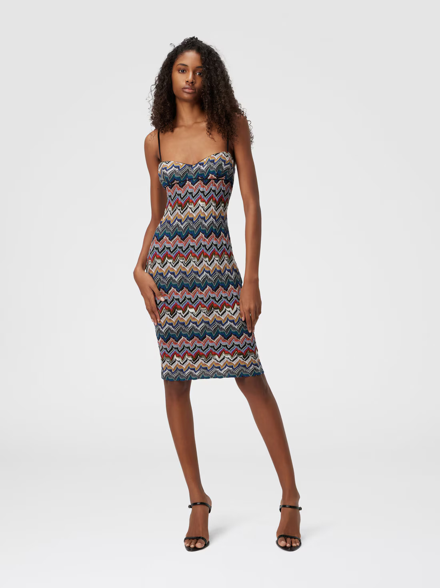</td>
        <td></td>
        <td>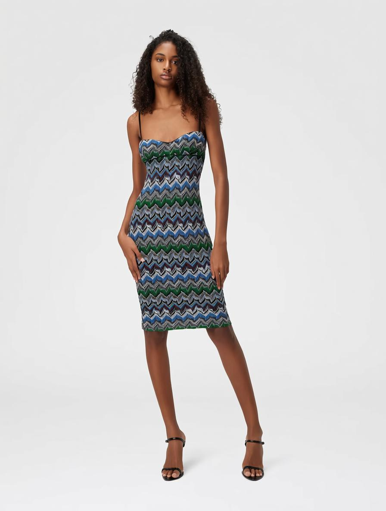</td>
    </tr>
    <tr>
        <td colspan="3" align="left"><i>5.jpg</i></td>
    </tr>
    <tr>
        <td>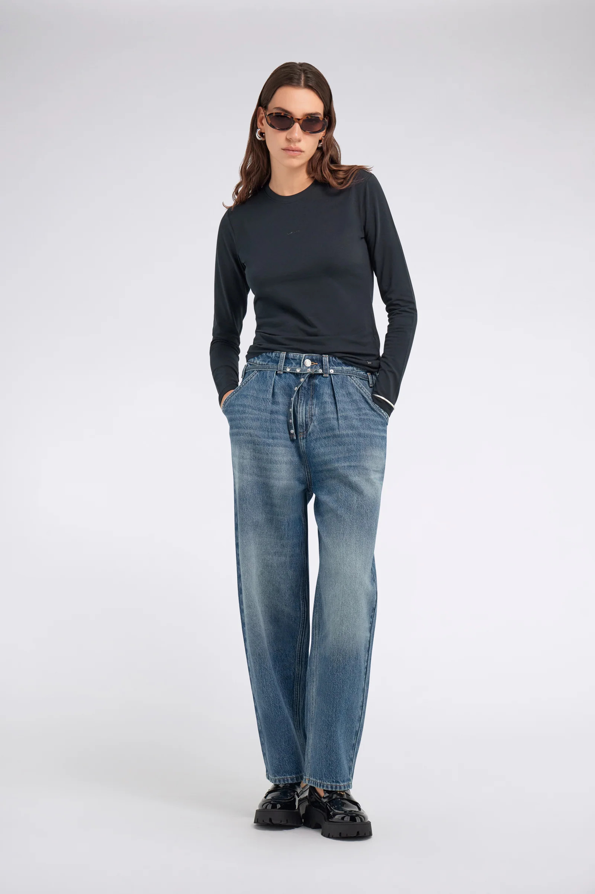</td>
        <td>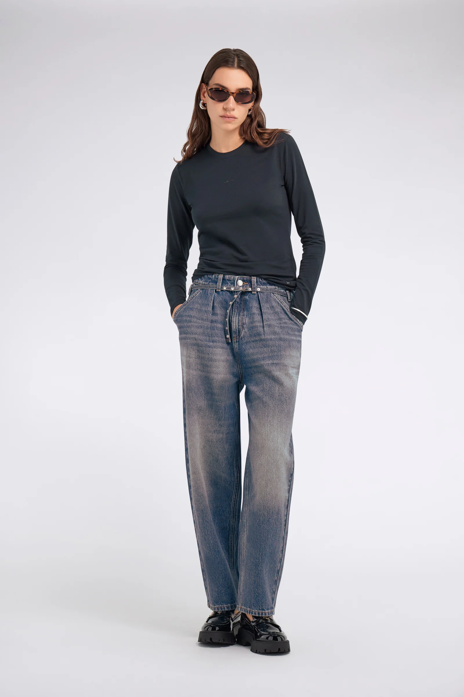</td>
        <td>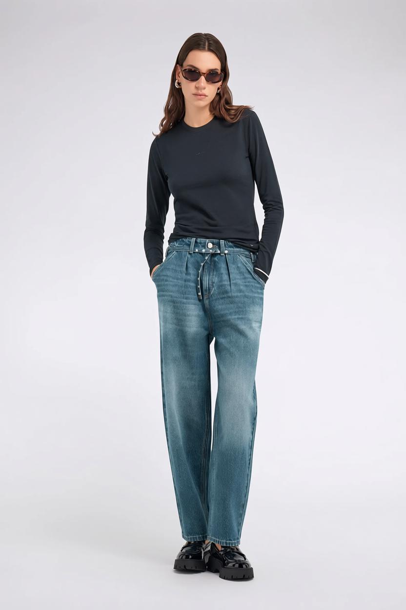</td>
    </tr>
</table>

## References

[1] https://github.com/facebookresearch/sam2

[2] https://github.com/IDEA-Research/GroundingDINO

[3] https://github.com/IDEA-Research/Grounded-Segment-Anything

[4] https://huggingface.co/black-forest-labs/FLUX.1-Kontext-dev 

[5] https://huggingface.co/Qwen/Qwen-Image-Edit

[6] https://arxiv.org/abs/2406.09897 

[7] https://github.com/ostris/ai-toolkit 

[8] https://build.nvidia.com/black-forest-labs/flux_1-kontext-dev/modelcard


